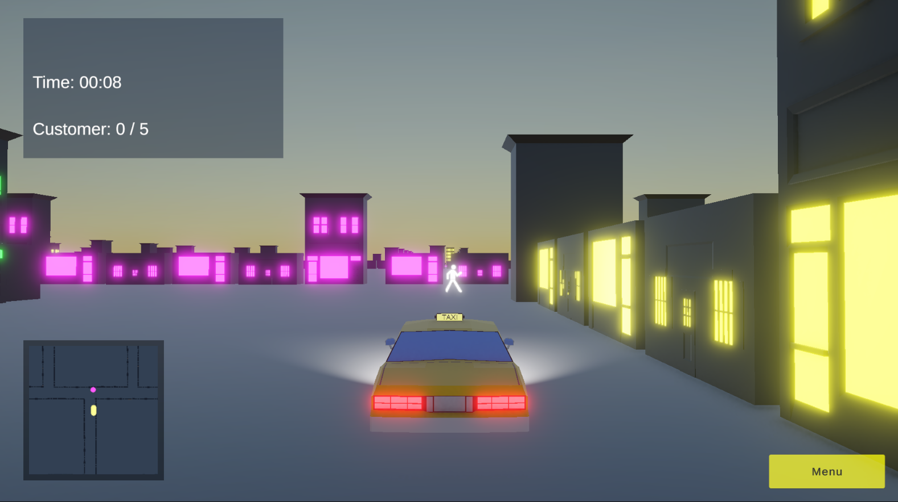
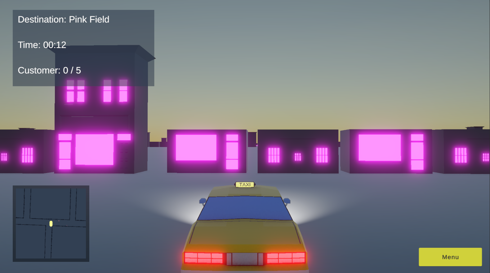
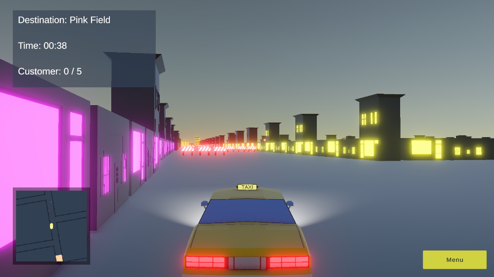
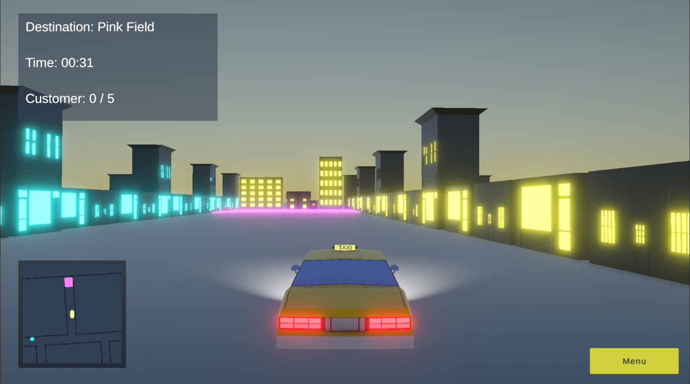
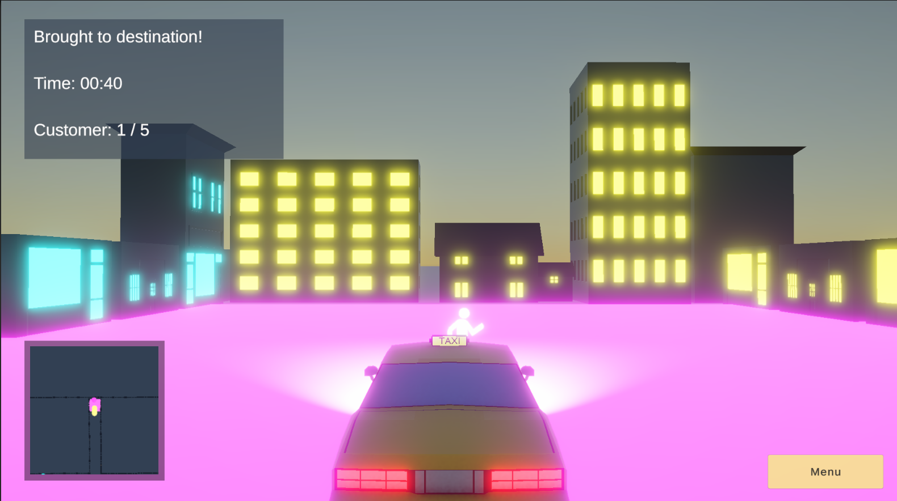
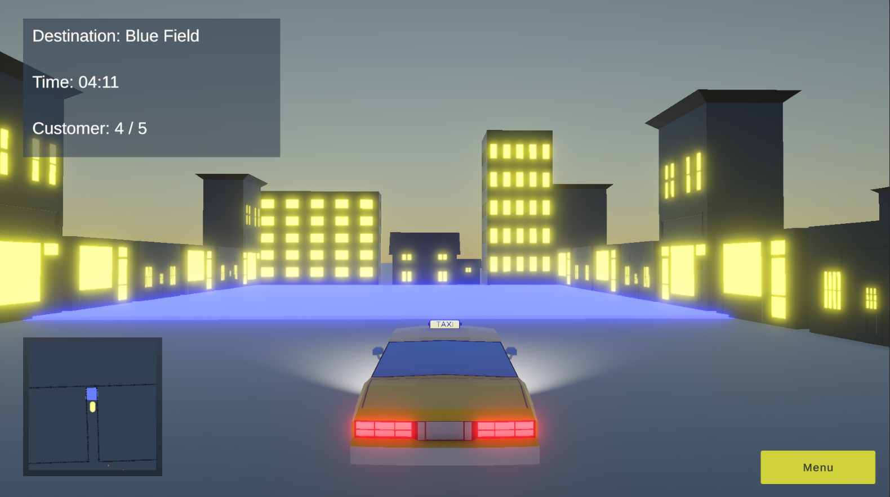
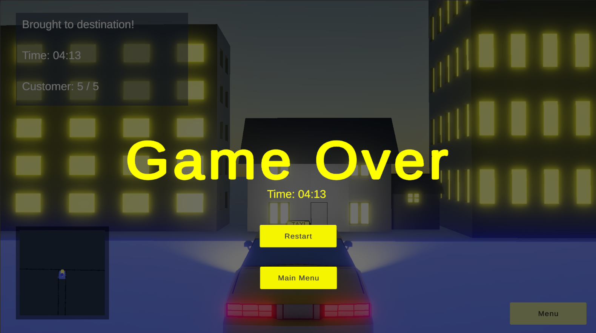

<h2>Facharbeit: Flashy Taxi</h2>

Hallo und willkommen auf meinem GitHub-Profil!

Hier findest du meine Facharbeit, die ich im Rahmen meiner schulischen Ausbildung erstellt habe.

Dabei handelt es sich um ein kleines Taxi-Racing-Game namens Flashy Taxi, in dem man Passagiere möglichst schnell von A nach B befördern muss. Ziel ist es, alle Kunden effizient und schnell an ihr Ziel zu bringen.

Das Spiel wurde in Unity entwickelt, die 3D-Modelle habe ich mit Blender erstellt. Die Programmierung erfolgte mit C#.

<h3>Screenshots</h3>

Ein paar Eindrücke aus dem Spiel:

1. Auf dem Weg zum ersten Kunden

2. Kunde wurde aufgenommen, das pinke Feld zeigt das Ziel

3. Fahrt zum Zielpunkt

4. Ziel ist in Sicht, nun auch auf der Mini-Map erkennbar

5. Kunde wurde erfolgreich abgeliefert

6. Der letzte Kunde wird abgeliefert

7. Game Over – man kann neu starten oder ins Menü zurückkehren

